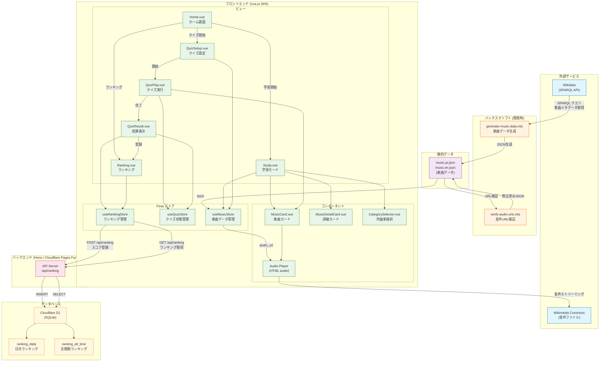

# アーキテクチャ図

## システム全体構成図

以下の図は、クラシック音楽学習アプリの全体アーキテクチャを示しています。各コンポーネント間のやりとり、外部サイトからの情報取得、ランキング情報登録のデータフローが一目でわかるようになっています。



## データフローの説明

### 1. 楽曲データ生成フロー (開発時)

```
Wikidata (SPARQL) → generate-music-data.mts → music.*.json → verify-audio-urls.mts → 検証済みJSON
```

1. **Wikidata SPARQL API** から有名な作曲家の楽曲メタデータを取得
2. **generate-music-data.mts** がJSONファイルを生成
3. **verify-audio-urls.mts** がWikimedia Commons APIで音声URLを検証・修正
4. 検証済みの `music.ja.json` / `music.en.json` を `public/` に配置

### 2. 音声再生フロー (実行時)

```
ユーザー操作 → MusicCard → AudioPlayer → Wikimedia Commons → 音声再生
```

1. ユーザーが再生ボタンをクリック
2. `MusicCard` コンポーネントが `audio_url` を取得
3. HTML `<audio>` 要素が **Wikimedia Commons** から音声をストリーミング再生

### 3. ランキング登録フロー

```
QuizResult → RankingStore → POST /api/ranking → Hono API → Cloudflare D1
```

1. クイズ完了後、**QuizResult** でスコアを計算
2. ニックネーム入力後、**RankingStore** がAPIにPOSTリクエスト
3. **Hono API** がリクエストを処理
4. **Cloudflare D1** に日次ランキングと全期間ランキングを登録

### 4. ランキング取得フロー

```
Ranking画面 → RankingStore → GET /api/ranking → Hono API → Cloudflare D1 → 表示
```

1. ランキング画面表示時、**RankingStore** がAPIにGETリクエスト
2. **Hono API** がD1から上位100件を取得
3. フロントエンドでランキングテーブル/カードを表示

## コンポーネント間の関係

| コンポーネント | 役割 | 依存先 |
|:---|:---|:---|
| `Home.vue` | ホーム画面、メニュー表示 | - |
| `Study.vue` | 学習モード、フラッシュカード | `MusicStore`, `MusicCard`, `CategorySelector` |
| `QuizSetup.vue` | クイズ設定画面 | `MusicStore`, `CategorySelector` |
| `QuizPlay.vue` | クイズ実行画面 | `QuizStore`, `MusicCard` |
| `QuizResult.vue` | 結果表示、ランキング登録 | `QuizStore`, `RankingStore` |
| `Ranking.vue` | ランキング表示 | `RankingStore` |
| `MusicCard.vue` | 楽曲カード (音声再生付き) | Wikimedia Commons |
| `MusicDetailCard.vue` | 楽曲詳細表示 | - |
| `CategorySelector.vue` | 作曲家フィルター | `MusicStore` |

## 技術スタック

| レイヤー | 技術 | 用途 |
|:---|:---|:---|
| フロントエンド | Vue 3 + TypeScript | SPA構築 |
| 状態管理 | Pinia | グローバルステート管理 |
| スタイリング | Tailwind CSS | レスポンシブUI |
| バックエンド | Hono | APIサーバー |
| ホスティング | Cloudflare Pages | 静的サイト + Functions |
| データベース | Cloudflare D1 (SQLite) | ランキングデータ永続化 |
| 外部データ | Wikidata + Wikimedia Commons | 楽曲メタデータ + 音声ファイル |
